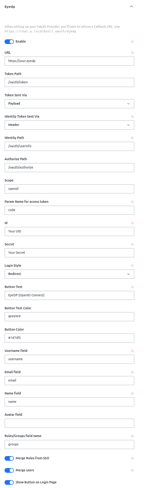
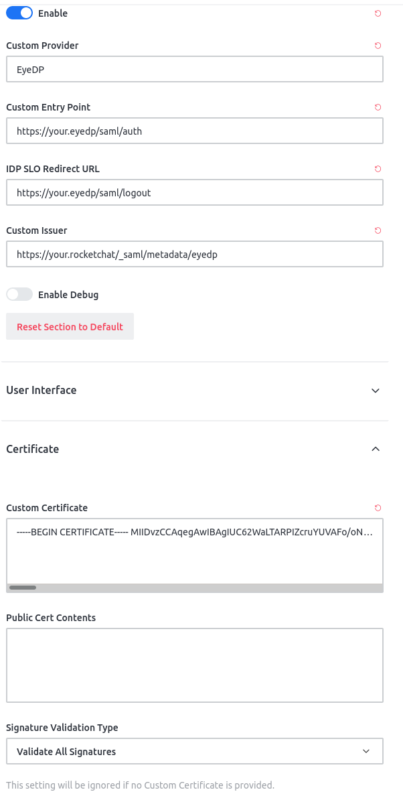

# EyeDP

EyeDP is a federating identity provider. It is designed to be very self-contained and with minimal dependencies to run, so that it's very easy to setup. It exposes the configuration necessary to implement a SAML Identity Provider, as well as supporting an Nginx auth_request endpoint that will evaluate group based permissions.

EyeDP is dual licensed under the Apache2 and MIT licenses.

EyeDP is proud to use [Translation.io](https://translation.io) for our localisation.

## Reporting Issues

To report sensitive or security issues, we prefer that confidential issues be created on [our Gitlab.com issue tracker](https://gitlab.com/CentauriSolutions/eyedp-issues/-/issues/new?issue[confidential]=true). For non-sensitive bugs or feature requests, please create a [new issue on Github.com](https://github.com/CentauriSolutions/EyeDP/issues/new).

## Contents

- [Overview](#overview)
- [Usage](#usage)
- [Deployment](#deployment)
  + [heroku](#heroku)
  + [docker](#docker)
- [Identity Provider](#identity-provider)
  + [OpenID Connect](#openid-connect)
    - [OIDC with Rocket.Chat](#openid-connect-with-rocketchat)
  + [SAML](#saml)
    - [SAML with Gitlab](#saml-with-gitlab)
    - [SAML with Rocket.Chat](#saml-with-rocketchat)
  + [Nginx Auth Request](#nginx-auth-request)
- [Management](#management)
  + [Operators](#operators)
  + [Managers](#managers)
  + [Administrators](#administrators)
- [Development](#development)

## Overview

### Users and Groups

The basic model for users and groups in EYEdP is similar to the model of LDAP, where users can be members of many groups, and a group can be nested. In addition, there is the concept of permissions which are inherited by a user from their groups.

#### Users

A User is an entity that can sign into the identity provider. They have an email, two factor authentication keys, etc. Through their membership in various groups, they can have many permissions associated.

#### Groups

A Group is a named collection of Groups and Permissions.

#### Permissions

A Permission is the name given to a capability for a group.

## Usage

EYEdP is a fairly standard Rails application that expects a database connection. The easiest way to setup an instance of EYEdP is to use the pre-built Docker container and attach it to a postgres container. An example topology can be seen in the [docker-compose.yml](./docker-compose.yml) in the main repository.

Alternately, a normal Ruby on Rails environment can be used to setup EYEdP, such as Heroku, a normal virtual machine, or a dedicated machine. The only required setup to get the application running it to configure the database.yml with the necessary options to configure the PostgreSQL database. The easiest way to configure the database is to export a `DATABASE_URL` environment veriable to the Rails process. Before starting EYEdP for the first time, the administrator should ensure that they run `bin/setup` to ensure that the database is ready for use.

In addition to Postgres, Redis is a required component of an EyeDP installation. The default settings will look for redis hosted at `127.0.0.1:6379` but can be configured with `REDIS_URL`

### Getting Started

The first thing to do after the initial setup is to log in as the initial admin
user and change the password unless this was customized via the environment during initial setup. This can be done at `$ROOT_URL/users/edit`.

Next, the global settings should be configured. As an admin user, navigate
to `admin/settings` and update the values there:

<dl>
  <dt><strong>Base</strong></dt>
  <dd>This should be updated to the root url of your installation</dd>
</dl>

Next, depending on your needs, you will need to configure SAML and OpenID Connect:

To configure SAML, you should navigate to `admin/settings/saml` and update:

<dl>
  <dt><strong>Certificate</strong></dt>
  <dd>This is the certificate generated in <a href='#saml'>SAML</a></dd>
  <dt><strong>Key</strong></dt>
  <dd>This is the key generated in <a href='#saml'>SAML</a></dd>
</dl>

To configure OIDC, you should navigate to `admin/settings/openid_connect` and update:

<dl>
  <dt>Signing Key</dt>
  <dd>This is the key generated in <a href='#openid-connect'>OpenID Connect</a></dd>
</dl>


## Deployment

### Heroku

#### One-Click Heroku Deployment

The easiest way to start using EyeDP is by deploying it to
[Heroku](https://www.heroku.com/).

If you are reading this document in a browser all you need to do is click the
button bellow and fill in the environment variables for your seed user (admin):
`SEED_USERNAME`, `SEED_PASSWORD` and `SEED_EMAIL`. Please note that `SEED_PASSWORD` must be at least 8 characters long. 

[](https://heroku.com/deploy?template=https://github.com/centaurisolutions/eyedp)

A free Heroku plan could be used to run EyeDP at a small scale, but it is worth
using hobby or larger for any kind of production deployment.

### Docker

The easiest way to get started hosting EyeDP on your own infrastructure
is to use Docker Compose. The following can be customized to your needs and
should be places behind a load-balancer, such as Traefik or Nginx.

```yaml
version: '3'
services:
  db:
    image: postgres
    volumes:
      - 'postgres:/var/lib/postgresql/data'
    environment:
      - POSTGRES_USER=postgres
      - POSTGRES_PASSWORD=super-secure-password
  redis:
    image: redis
    volumes:
      - 'redis:/data'
  web:
    image: centaurisolutions/eyedp
    volumes:
      - ./log:/eyedp/log
    ports:
      - "3000:3000"
    depends_on:
      - db
      - redis
    links:
      - db
      - redis
    environment:
      - RAILS_ENV=production
      - DATABASE_URL=postgres://postgres:super-secure-password@db:5432/eyedp
      - SECRET_KEY_BASE=o8w64gurfvwtiu64wlyregfvcw74iu6eryfV
      - DISABLE_SSL=true
      - RAILS_SERVE_STATIC_FILES=true
      - SSO_DOMAIN=.example.com
      - TOTP_ENCRYPTION_KEY=something-really-awesome-that's-at-least-32-bytes
  sidekiq:
    image: centaurisolutions/eyedp
    command: bundle exec sidekiq
    volumes:
      - ./log:/eyedp/log
    depends_on:
      - db
      - redis
    links:
      - db
      - redis
    environment:
      DATABASE_URL: postgres://postgres:super-secure-password@db:5432/myapp_development
      TOTP_ENCRYPTION_KEY: something-really-awesome-that's-at-least-32-bytes
      REDIS_URL: redis://redis:6379
      RAILS_ENV: development
volumes:
  postgres:
  redis:
```

After configuring this how you want it, you can initialize the database and
first admin user with `docker-compose run web bin/setup` and then you can start
the application with `docker-compose up -d`.

When you're ready to put a load balancer in front of EyeDP, it is recommended
to configure it to  aggressively cache resources that come from the `/assets`
path, as these include hashes to ensure that they are highly cachable as well
as updatable by the application. An example configuration for Nginx follows:

```
proxy_cache_path /var/cache/nginx/eyedp levels=1:2
                   keys_zone=eyedp:10m max_size=1g inactive=60m;

upstream app {
    server localhost:3000 fail_timeout=0;
}

server {
    listen 80;
    server_name localhost;

    proxy_cache_key $scheme$request_method$host$request_uri;
    
    location /assets/ {
        proxy_redirect off;
        proxy_pass_header Cookie;
        proxy_ignore_headers Set-Cookie;
        proxy_hide_header Set-Cookie;

        proxy_cache eyedp;
        proxy_cache_valid 200 302  120m;
        proxy_cache_valid 404      1m;

        proxy_pass http://app;
    }


    location / {
        proxy_pass http://app;
        # This assumes that you actually are using https
        proxy_set_header X-Forwarded-Proto https;
        proxy_set_header X-Real-IP $remote_addr;
        proxy_set_header X-Forwarded-For $proxy_add_x_forwarded_for;
        proxy_set_header Host $http_host;
        proxy_redirect off;
    }

    error_page 500 502 503 504 /500.html;
    client_max_body_size 4G;
    keepalive_timeout 10;
}
```

To use the above configuration with the caching bits, you'll need to ensure
that the cache directory exists: `mkdir -p /var/cache/nginx/eyedp`.

## Identity Provider

EYEdP supports many different authentication frameworks, allowing it to be
integrated with many different service providers.

To start setting up Identity Providers, the admin should configure the
`idp_base` setting to be the fully qualified domain name (FQDN) of the
authentication server.

### OpenID Connect

OpenID Connect requires setting up the  `signing_key`. The signing key can be
generated via a command like
`openssl genpkey -algorithm RSA -out key.pem -pkeyopt rsa_keygen_bits:2048`. 

#### OpenID Connect with Rocket.Chat

To configure Rocket.Chat to use OpenID Connect, you must setup a custom Oauth provider.

In the admin interface, you should scroll down to Oauth and open that. At the top, you should click "Add custom oauth". At this page, you will need to configure a few things:

- URL: The URL to your EyeDP installation
- Token Path: `/oauth/token`
- Token Sent Via: `Payload`
- Identity Token Sent Via: `Header`
- Identity Path: `/oauth/userinfo`
- Authorize Path: `/oauth/authorize`
- Scope: `openid`
- Param Name for access token: `code`
- Id: The UID configured in EyeDP
- Secret: Secret configured in EyeDP
- Login Style: Redirect
- Username field: `username`
- Email field: `email`
- Name field: `name`
- Roles/Groups field name: `groups`



It is also possible to enable Merging Roles from SSO, Merging users, and Showing Button on Login Page.

At this point, a user should be able to login to Rocket.Chat via OpenID Connect with EyeDP!

### SAML

Saml requires a few pieces of configuration, `certificate` and `key`. Generating
SAML's key and certificate should look like:
`openssl req -x509 -sha256 -nodes -days 3650 -newkey rsa:2048 -keyout myKey.key -out myCert.crt`.
This will generate a key and certificate with an expiration of ten years.
It is entirely possible to change this expiration time as well.

When configuring EyeDP as an Identity Provider, you will likely be required to
supply the SHA1 fingerprint of your certificate. To generate this, you can run
`openssl x509 -noout -fingerprint -sha1 -inform pem -in myCert.crt` given the
`myCert.crt` file generated before; alternately, you can view the SHA1 in the settings page after configuring your certificate.

#### SAML with Gitlab

It is possible to follow
[Gitlab's documentation](https://docs.gitlab.com/ee/integration/saml.html)
on setting up SAML, or following the directions here to configure it with
EyeDP specifically.

To setup Gitlab with EyeDP as an Identity Provider, SAML is one of the options.
Configuration requires that the certificate's fingerprint be collected before
beginning, as shows above.

To begin, add the following to your `gitlab.rb`

```ruby
gitlab_rails['omniauth_providers'] = [
  {
    name: 'saml',
    args: {
             assertion_consumer_service_url: 'https://gitlab.example.com/users/auth/saml/callback',
             idp_cert_fingerprint: '82:32:F6:8A:F5:D0:F0:FC:22:A4:84:23:D5:0F:1E:7C:91:2B:40:AC',
             idp_sso_target_url: 'https://eyedp.example.com/saml/auth',
             issuer: 'http://gitlab.example.com',
             name_identifier_format: 'urn:oasis:names:tc:SAML:2.0:nameid-format:persistent'
           },
    label: 'Company Login' # optional label for SAML login button, defaults to "Saml"
  }]
gitlab_rails['omniauth_allow_single_sign_on'] = ['saml']
gitlab_rails['omniauth_block_auto_created_users'] = false
```

It is also possible to enable auto-linking of your SAML users with Gitlab users
and is recommended if you're using SAMl as the primary identity provider for
a Gitlab installation:

```ruby
gitlab_rails['omniauth_auto_link_saml_user'] = true
```

Additionally, EyeDP groups can be mapped into Gitlab groups with:

```ruby
gitlab_rails['omniauth_providers'] = [
  {
    name: 'saml',
    groups_attribute: 'Groups',

    external_groups: ['Freelancers', 'Interns'],
    required_groups: ['Developers', 'Managers', 'Admins'],
    admin_groups: ['Managers', 'Admins'],
    auditor_groups: ['Auditors', 'Security'],
    ...
  }]
```

All of the example groups above are optional so you can use only the ones you
need.

Gitlab can also automatically redirect to the sign-in provider with:

```ruby
  gitlab_rails['omniauth_auto_sign_in_with_provider'] = 'saml'
```

#### SAML with Rocket.Chat

To configure Rocket.Chat to use EyeDP via SAML, you should configure:

- Custom Entry Point: https://your.eyedp/saml/auth
- IDP SLO Redirect URL: https://your.eyedp/saml/logout
- Custom Issuer: https://your.rocket.chat/_saml/metadata/eyedp

Additionally, it is strongly recommended to insert EyeDP's SAML certificate into the Custom Certificate field, and ensure that "Validate All Signatures" is selected in the "Signature Validation Type" box.




### Nginx Auth Request

The Nginx Auth Request backend is a fairly basic, group membership based
permission check that allows implementing access restriction to applications
that may not have their own acess controls at the Nginx layer. To learn more
about how to use it, an admin should peruse the [groups](#groups) section of
the documentetion.

In the Nging Auth Request backend, a user's email and username are set as
response headers: `EyeDP-Email` and `EyeDP-Username`. As a result, Nginx is
capable of interpreting these headers and send them to other appication
backends!

## Management

Managing an identity provider can be a complex task requiring many different
types of users. 

### Operators

An operator is a type of user that can manage EyeDP itself, but cannot manage
users or groups. A user becomes an operator when they're added to a group that
has the operator flag enabled, which can be done in the admin UI by an
administrator.

In this context, managing EyeDP means that an operator can manage SSO
applications such as OpenID Connect and SAML applications. In additional, they
can change EyeDP's settings, such as key data for the IdP, hostnames, and
templates.

### Managers

A manager is a type of user that can manage users and groups, but cannot
manage EyeDP. A user becomes a manager when they're added to a group that
has the manager flag enabled, which can be done in the admin UI by an
administrator.

A manager cannot add or remove a user from an operator or administrator group,
nor change those flags on other groups. A manager user can add and remove
additional managers.

### Administrators

A user becomes an administrator when they're added to a group that
has the admin flag enabled, which can be done in the admin UI by an
administrator.

An administrator has no restrictions on the actions that they can perform, so
should be a small group of users. An administrator account is needed to change
membvership in administrator and operator groups, as well as creating and
managing these group types.

## Development

To setup your development environment, ensure that you have a postgres
user setup that can create the database (either your current user, or setup the
environment variables in .env correctly) and run
`bundle exec rails db:create db:migrate db:seed`. After the database has been
initialized, you can run the development server with
`bundle exec rails server`.

### Email

If you're going to be testing with email, you need to `gem install mailcatcher`
and then execute `mailcatcher`. This will start an SMTP server and HTTP server
on 1025 and 1080, respectively, that can be used to confirm email is what you
expect. If you'd like to run the `mailcatcher` application in the foreground,
you can use `mailcatcher -f`.
